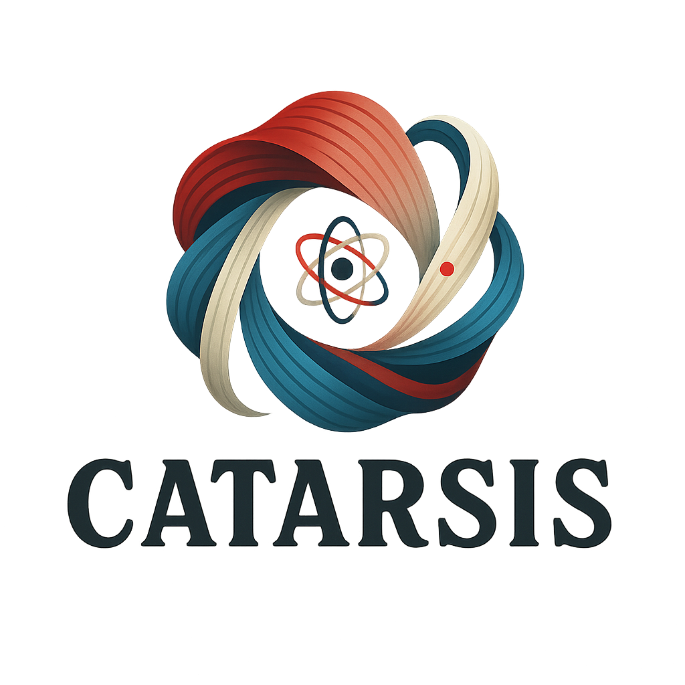

<!-- Logo -->

  

<!-- Acápite -->
<blockquote style="text-align:center; font-style:italic;">
  “Se puede emplear el término <strong>‘catarsis’</strong> para indicar el paso del momento meramente económico al momento ético-político ... 
  Esto significa también el paso de lo objetivo a lo subjetivo y de la necesidad a la libertad... 
  <strong>La fijación del momento catártico se convierte así en el punto de partida para toda la filosofía de la praxis</strong>.”
    — Antonio Gramsci
</blockquote>

  <h3>🧠 Confirmá que no sos un robot</h3>
  
Ingresá la clave compartida por quien te invitó:

  <input type="text" id="clave-input" placeholder="Escribí la clave..." style="padding:0.5em; width:60%;">
    
  <button onclick="verificarClave()" style="padding:0.5em 1em;">✓ Confirmar</button>
  

## 🗞️ Publicación de junio 2025

### 📍 ¿Qué es hoy el desarrollo?  
**¿Qué implica hoy hablar de desarrollo sin caer en el vacío tecnocrático o en el cinismo multilateral?**  
Una exploración crítica del concepto bajo crisis y el problema de la legitimidad del progreso.

<!-- PEGA AQUÍ EL CONTENIDO COMPLETO DE TU ARTÍCULO -->

## 📚 Archivo por año
### 2025
- Mayo: *Tiempos sin estrategia*
- Abril: *El antagonismo difuso*
- Marzo: *La producción simbólica en crisis*
- Febrero: *La guerra y el silencio*
- Enero: *Inicios de ciclo*

<!-- COPIAR HASTA AQUÍ -->